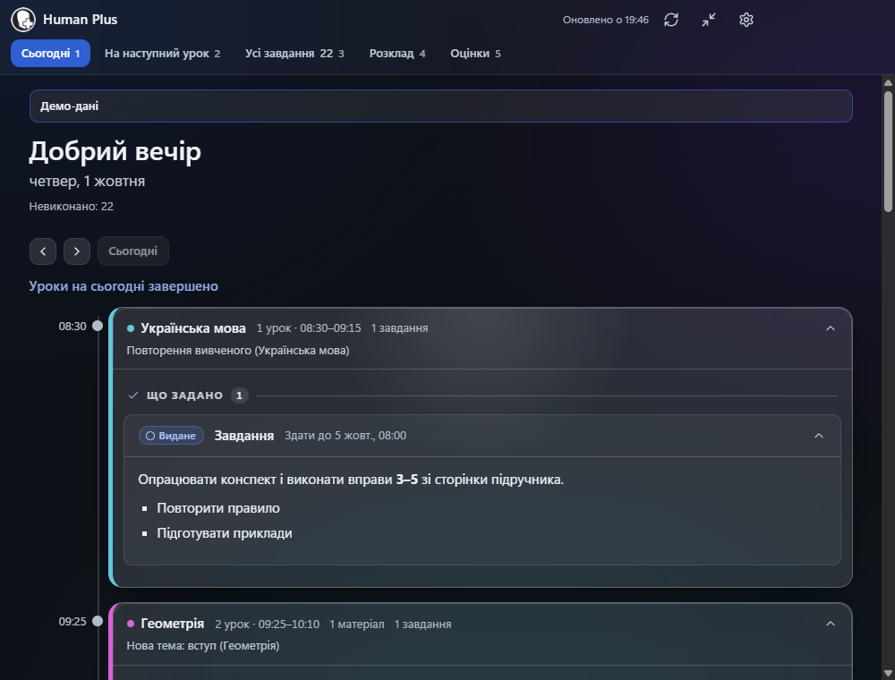
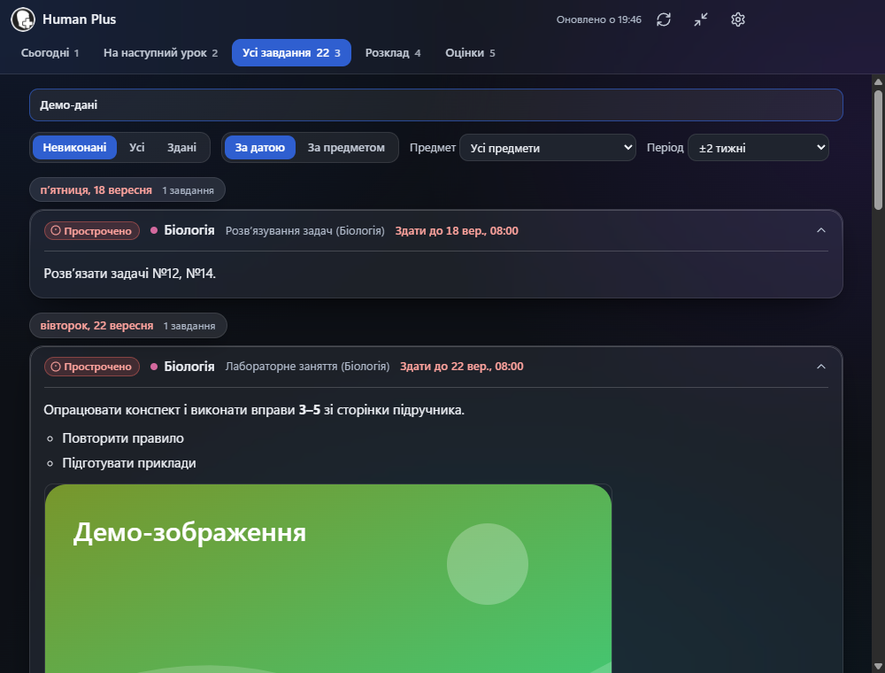
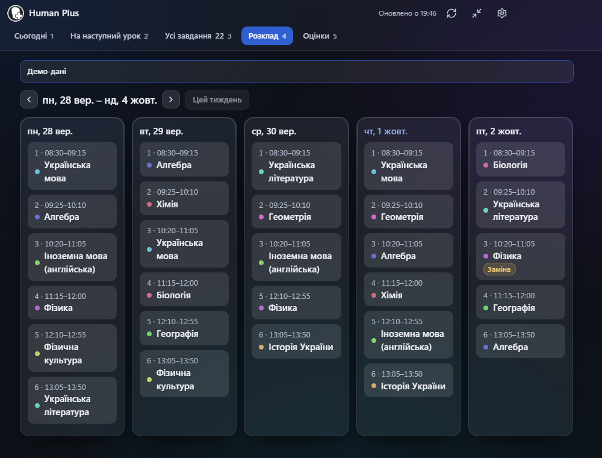
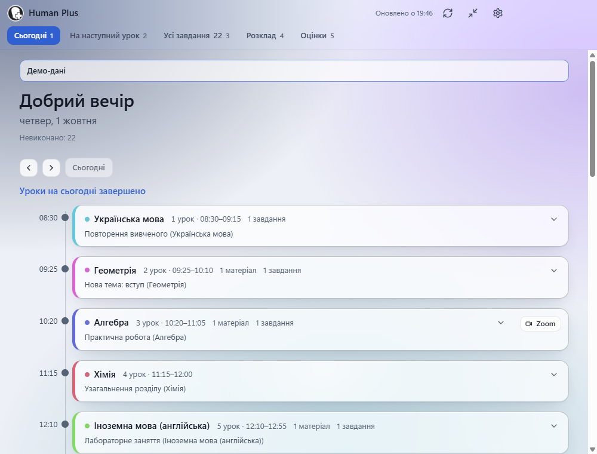
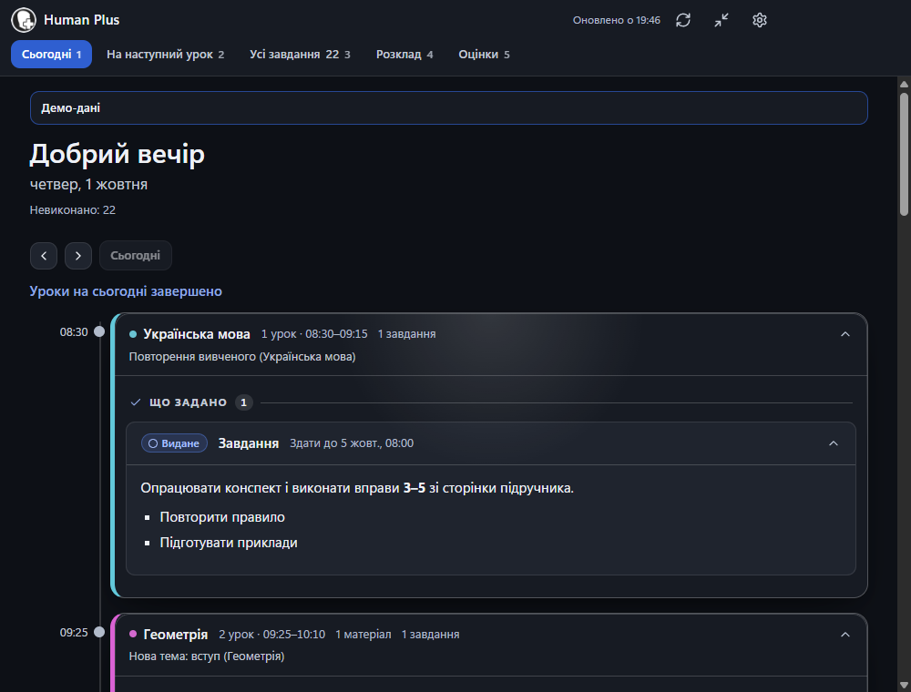
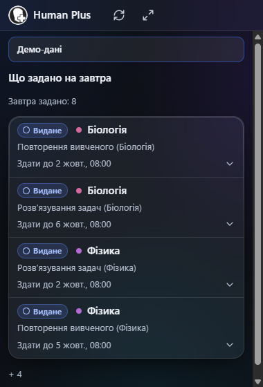
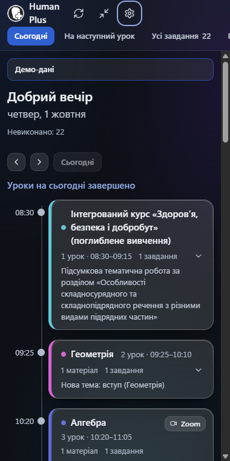

# Human Plus

**Застосунок для учнів HUMAN Школа.** Усе важливе для учня на одному екрані: розклад дня, що задано, що не виконано, оцінки.
Лише читання. Без здач завдань, без чужих даних, без телеметрії.



## Що вміє зараз

- **Сьогодні:** привітання, таймлайн уроків із підсвіченим поточним уроком і відліком до наступного. **Клік по уроку** розкриває «Заняття» (матеріали уроку)
  та «Завдання» (що задано на цьому уроці) з повним змістом.
- **На наступний урок:** для кожного предмета найближчий урок і невиконане ДЗ до нього, окремий блок «На завтра».
- **Усі завдання:** фільтри «Невиконані / Усі / Здані», предмет, групування за датою чи предметом, прострочене виділене, розгортання на місці.
- **Розклад:** тиждень із позначкою поточного часу, з урахуванням скасованих уроків і замін.
- **Оцінки** за предметами.
- **Увесь вміст усередині застосунку:** текст, заголовки, **фото**, **посилання** (картка з назвою й доменом, відкривається в браузері за кліком),
  **файли** (зберігаються в «Завантаження» за кліком), формули й таблиці. Жодних кнопок «Відкрити в Human».
- **Міні-режим «Що задано на завтра»:** це те саме вікно, що стає малим, поверх інших, із регульованою прозорістю (Ctrl+Shift+H).
- Лічильник невиконаного в треї та на панелі завдань, сповіщення «Завтра дедлайн» раз на день (можна вимкнути).
- Світла й темна теми, акцентний колір і кольори статусів на вибір, «скляні» ефекти (з автоматичним запасним режимом без прозорості).
- Офлайн: показуються збережені дані з позначкою; миттєвий старт із кешу, оновлення у фоні.

| Усі завдання | Розклад |
|---|---|
|  |  |

| Світла тема | Без прозорості | Міні-режим | Вузьке вікно |
|---|---|---|---|
|  |  |  |  |

Усі скриншоти зроблено на **демо-даних** (`npm run demo`), персональних даних учня в матеріалах немає.

## Чого застосунок **не** робить

- Не здає завдань, не змінює статусів, не пише повідомлень: до HUMAN іде лише `GET`.
- Не читає й не зберігає пароль чи токени: ви входите самі на справжній сторінці HUMAN всередині вікна.
- Не бачить чужих даних: лише акаунт учня, що увійшов. Для вчителя й будь-якої іншої ролі показується «Додаток доступний лише для учнів».
- Не збирає телеметрію й не звертається нікуди, крім `*.human.ua`.

## Як це працює

```
вікно (src/app.js, ванільний JS)  ←IPC→  main.js  →  session persist:human  →  api.human.ua / files.human.ua
        │ лише відмальовування               │ перевірка ролі, кеш, запити (лише GET)
        └ model.js (вибірки)                 └ service.js → api.js / blocks.js / normalize.js
```

1. Ви входите на сторінці HUMAN (вона відкривається всередині вікна); сесія живе у стандартному сховищі Electron.
2. `main.js` бере `uid` із куки `last-sub-client-id`, перевіряє роль (`system/info`) і лише для учня завантажує календар та завдання.
3. `normalize.js` перетворює відповіді на внутрішню модель (`Lesson`, `Task`, `Grade`); `blocks.js` — вміст завдань на безпечні блоки.
4. Вікно (без доступу до мережі, суворий CSP) лише показує дані; зображення й файли завантажує main-процес.

Усе, що знає про формат HUMAN, зосереджено в `src/api.js`, `src/blocks.js`, `src/normalize.js`.

## Приватність

Кеш лежить лише локально, паролі й токени не зберігаються, застосунок нікуди не надсилає дані. Докладніше — [PRIVACY.md](PRIVACY.md).
Кнопка **«Вийти й стерти дані»** прибирає куки, сховище сесії та кеш.

## Плани

Напрям проєкту змінюється: Human Plus має стати платформою зі вбудованими нейромережами, яка допомагатиме учневі з уроками: завантаження книжок, стеження за оцінками, власна пам'ять.
Зараз це лише плани, нічого з цього ще не реалізовано.

## Встановлення

**[⬇ Завантажити для Windows (остання версія)](https://github.com/PREDATTORRGGDR/Human-Plus/releases/latest)**

- `Human Plus-Setup-1.1.0.exe`: інсталятор (встановлення для поточного користувача, права адміністратора не потрібні);
- `Human Plus-portable-1.1.0.exe`: портативна версія без встановлення.

Контрольні суми SHA-256 — в описі релізу.

### Попередження Windows SmartScreen

Застосунок **не підписаний сертифікатом розробника**, тому Windows покаже синє вікно «Windows захистила ваш ПК».
Це очікувано. Щоб запустити: натисніть **«Докладніше»**, потім **«Виконати в будь-якому разі»**. Файли релізу зібрано локально з цього коду; перевірити файл можна за SHA-256 з опису релізу.

### З вихідного коду

Потрібен Node.js 22+.

```bash
npm ci
npm start          # справжній режим
npm run demo       # демо без акаунта
npm test           # тести
npm run dist       # інсталятор NSIS і portable у папці dist/
```

## Обмеження

- API HUMAN недокументоване й може змінитися: тоді частина секцій деградує (покажемо, що вдалося), а після виправлення в `src/api.js` усе повернеться.
- Не перевірено на акаунті вчителя: відмова спирається на перелічення ролей і юніт-тести `isStudent`.
- Скасування, перенесення й заміни уроків перевірено лише на порожніх даних; блоки `tx03`, `qn01`, `pl01` не підтверджені на живих даних (нерозпізнане показується повідомленням).
- Збірка не підписана (SmartScreen), автооновлення немає. Скляні ефекти Mica/Acrylic працюють у Windows 11 22H2+; на Windows 10 фон суцільний.

## Ліцензія

Усі права захищені. Застосунок можна безкоштовно встановлювати й використовувати для особистих некомерційних цілей; копіювати, змінювати чи поширювати код і збірки без письмової згоди власника не можна.
Перегляд коду в репозиторії лише для ознайомлення. Повний текст: [LICENSE](LICENSE).
